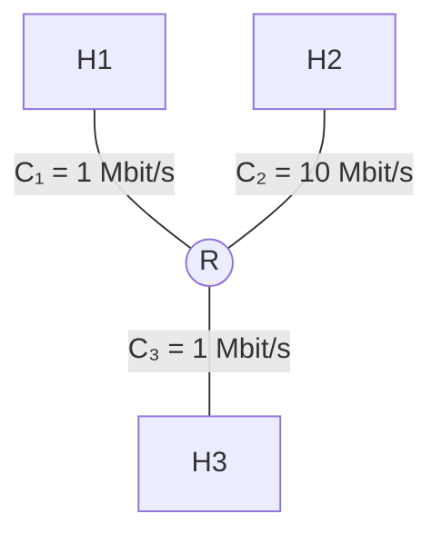

# Esercizio 1

Si consideri la rete descritta dalla figura sottostante: 

Si assuma che non ci sia altro traffico al di fuori di quello descritto successivamente e si trascurino i ritardi di
elaborazione e di propagazione.
Si calcoli il ritardo end-to-end per la trasmissione da H1 a H2 di:
a) 1 pacchetto da 6000 byte
b) oppure, 4 pacchetti da 1500 byte

Sappiamo che tutti i collegamenti hanno capacità: 
$$
C = 1 \ Mbit/s
$$
### a) 
La **formula del ritardo di trasmissione è:**
$$
d_{trasm} = \frac{L}{C}
$$
dove: 
- $L$ è la dimensione del pacchetto in **bit**; 
- $C$ è la velocità del collegamento in **bit/s**;

1. Convertiamo i byte in bit
	Sapendo che $1 \ byte = 8 \ bit$ allora $L = 6000 * 8 = 48000 \ bit$
	
2. Calcoliamo il tempo sul primo collegamento
	Il primo collegamento ha: 
	$$
	C = 1 \ Mbit/s = 1*10^6 \ bit/s
	$$
	Quindi: 
	$$
		d_{trasm} = \frac{4.8*10^4}{1*10^6} = 4.8*10^{-2} = 0.048 s
	$$
**Quindi H1 impiega 48ms per trasmettere completamente il pacchetto a R1**

3. Dopo R1
Il pacchetto deve attraversare 3 collegamenti, ciascuno da 1 Mbit/s. Su ciascuno servono 48ms 
Perciò: 
$$
d_{end-to-end} = 48 + 48 +48 = 144 ms
$$
### b)
Adesso abbiamo 4 pacchetti da 1500 byte ciascuno. 
Il meccanismo è sempre lo stesso: 
1. Convertiamo i byte in bit

	$1 \ byte = 8 bit \rightarrow L = 1500 * 8 = 1.2*10^4 \ bit$

2. Allora avremo: 
	$$
	d_{trasm} = \frac{1.2*10^4}{1*10^6}=1.2*10^{-2}s
	$$
 I pacchetti vengono trasmessi in **pipeline**: mentre un pacchetto passa al collegamento successivo, il successivo può essere trasmesso sul collegamento precedente.
 Il primo pacchetto arriva dopo:
$$
d_{end-to-end} = 12 + 12 + 12 = 36ms
$$
Ogni pacchetto successivo arriva dopo **12 ms**: 
$$
d_{end_to_end} = 36 + (4-1)*12 = 36+36 = 72 ms
$$
---

# Esercizio 2

Si consideri la rete descritta dalla figura sottostante:

Si assuma che non ci sia altro traffico al di fuori di quello descritto successivamente e si trascuri il ritardo di
elaborazione. Per ogni collegamento sono dati la velocità di trasmissione C e il ritardo di propagazione τ.
All'istante t = 0, l'host H1 inizia a trasmettere 3 pacchetti da 1000 bit all'host H2. Si calcolino:
**a)** gli istanti in cui ciascuno pacchetto è stato completamente ricevuto dall'host H2
**b)** l'eventuale ritardo di accodamento subito da ciascun pacchetto

### a)
#### 1. Prima calcoliamo i tempi di trasmissione
$$d_{trasm}=\frac{L}{C}=\frac{1*10^3bit}{2*10^6bit/s}=\frac{1}{2}*10^{-3}s=5*10^{-4}s$$
#### 2. Ora arriva la propagazione
Il primo pacchetto, dopo essere stato completamente trasferito da H1, deve **propagarsi** lungo il collegamento, quindi: 
$$\tau_{1}+0.5=1.5ms$$ E' il tempo in cui P1 arriva a R1

#### 3. Ora dobbiamo passare da R1 $\rightarrow$ H2
Il secondo collegamento è più lento, infatti: 
$$
C_{2}=1Mbit/s \rightarrow d_{trasm} = \frac{1*10^3}{10^6}=1ms
$$
Ma quando arriva P2 a R1?
$1.5ms$ esattamente nello stesso istante in cui P1 comincia a essere trasmesso sul secondo collegamento. 

#### Arrivo di P1 a H2
Abbiamo calcolato che P1 arriva ad R1 in: 
$$1.5 ms$$

la trasmissione sul secondo link: 
$$1.5ms + 1ms=2.5ms$$ 
Poi la propagazione: $$2.5ms+\tau_{2}=4.5ms$$ 
#### P2 a H2
P2 arriva a R1:
P2 viene completamente trasmesso da H1 in 1 ms, poi subisce 1ms di propagazione, quindi in $2ms$
ma a $t = 2ms$, il collegamento trasmesso R1 $\rightarrow$ H2 è ancora occupato fino a $2.5 ms$, quindi P2 deve aspettare $0.5ms$, **questo è il suo ritardo di accodamento.** 
Poi: 
Trasmissione: 1ms
Propagazione: 2 ms

perciò: 
$$
2.5+1+2=5.5ms
$$
#### P3
P3 viene trasmesso completamente da H1 a: 
$$
1.5 ms
$$
**Propagazione**: $1.5ms+\tau_{1}=2.5ms$

P3 arriva ad R1 quando P1 viene trasmesso sul secondo link, ma deve aspettare P2:
$$
3.5-2.5=1ms
$$
Quindi P3 verrà trasmesso sul secondo link a $t= 3.5ms$ 
Poi: 
$$
3.5 + 1 + 2 = 6.5ms
$$

---
# Esercizio 3

Il diagramma sottostante rappresenta una rete a commutazione di pacchetto nella quale tre host H1, H2 e
H3 sono attaccati a un singolo router R (operante in modalità store-and-forward e con politica FIFO per la
gestione della coda) ciascuno con un collegamento diverso.
All’istante t=0, l’host H1 invia ad H3 due pacchetti di 4000 bit ciascuno, mentre l’host H2 all’istante t=2 ms
invia ad H3 un solo pacchetto di 5000 bit. Trascurando i ritardi di propagazione e di elaborazione e
supponendo la rete non trafficata:
I. calcolare il tempo per trasferire i due pacchetti da H1 ad H3;
II. calcolare il tempo per trasferire il pacchetto da H2 ad H3;
III. determinare se qualche pacchetto subirà un ritardo di coda e
nel caso affermativo calcolarne il valore.

## I. 
Abbiamo H1 $\rightarrow$ H3 2 pacchetti da 4000 bit, H2 $\rightarrow$ H3 1 pacchetto di 5000 bit.
Vogliamo sapere il tempo per trasferire i due pacchetti da H1 a H3: 

1. Quanto tempo impiega H1 a trasmettere un pacchetto?
H1 ha: 
$$
C_{1} = 1*10^6 bit/s
$$
Ogni pacchetto è $L_{1}=4000bit$, quindi: 
$$
d_{trasm,H1}=\frac{4*10^3}{1*10^6}= 4*10^{-3}s
$$
H1 invia due pacchetti consecutivamente:
Dato che il ritardo di propagazione è trascurato possiamo concludere che il pacchetto P1 per arrivare da H1 a H3 impiega $4ms$ mentre il secondo $8ms$.

## II.
H2 inizia a trasmettere a $t=2ms$
Il pacchetto è di: 

$5000bit$

e: 
$$
C_{2} = 10Mbit/s
$$
Quindi:
$$
d_{trasm, H2} = \frac{5*10^3}{10*10^6}=\frac{1}{2}*10^{-3}s=0.5ms
$$
Pertanto H2 trasmette: 
`P3: 2 ms ─── 2.5 ms` 
e P3 arriva a R a: 
$$
2.5 ms
$$
## III.

### P3
$$
d_{trasm,3}(P3)=\frac{5*10^3}{1*10^6}=5*10^{-3}=5ms
$$
P3 quindi arriva a R a 2.5ms, quindi R lo può trasmettere immediatamente: 
$$
P3 \ arriva \ a \ H3 \ a \ 7.5ms
$$
### P1 
P1 arriva ad R a $4ms$ ma **R deve ancora trasmettere P3**, quindi perché venga trasmesso P1: 
$$
7.5 - 4 = 3.5 ms
$$
Questo è **il ritardo di accodamento di P1**.
poi P1 viene trasmesso per: 
$$\frac{4*10^3}{1*10^6}=4ms$$
Quindi: 
$$7.5ms+4ms=11ms$$
### P2
P2 arriva a R a 8ms, ma P1 sta venendo ancora trasmesso 11.5 ms
$$
11.5ms-8ms=3.5ms
$$
Questo è **il ritardo di accodamento di P2**.
Poi P2 viene trasmesso per: 
$$\frac{4*10^3}{1*10^6}=4*10^{-3}=4ms$$

E quindi: 
$$11.5ms+4ms=15.5ms$$---
# Esercizio 4

Invio di D bit di dati in n pacchetti. Si assuma che le intestazioni siano trascurabili. Calcolare una stima del ritardo end to end complessivo.

$C_{2} \leq C_{1} \leq C_3$ 

Ogni pacchetto ha:
$$
L = \frac{D}{n} bit
$$
Sul primo collegamento: 
$$
d_{trasm}=\frac{\frac{D}{n}}{C_1}=\frac{D}{nC_1}
$$
Inoltre c'è il ritardo di propagazione: 
$$
\tau_1
$$
Quindi il primo pacchetto impiega: 
$$
\frac{D}{nC1}+\tau_1 
$$
Per arrivare ad R1

### Poi arriva il collegamento 2
Sul secondo collegamento abbiamo: 
$$
d_{trasm,2}=\frac{D}{nC_2}
$$
e propagazione: 
$$
\tau_2
$$
Dato che: 
$$
C_2 \leq C_1
$$
Il collegamento 2 è almeno altrettanto lento del primo. 
Quindi mentre R1 sta trasmettendo un pacchetto sul collegamento 2 può arrivare il pacchetto successivo dal collegamento 1. 
Si crea quindi la **pipeline.**

### Il collo di bottiglia
Il collegamento più lento è: 
$$
C_{2}
$$
Quindi dopo che il primo è entrato nella pipeline, i pacchetti successivi avanzano sostanzialmente al ritmo del collegamento 2. 
Per n pacchetti, il termine dominante è quindi: 
$$
n⋅\frac{D/n}{C_2}
$$
semplificando: 
$$
\frac{D}{C_2}
$$
